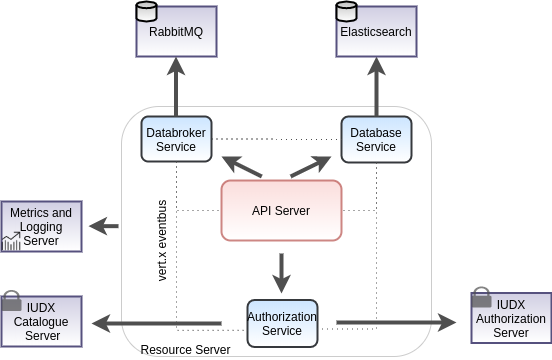
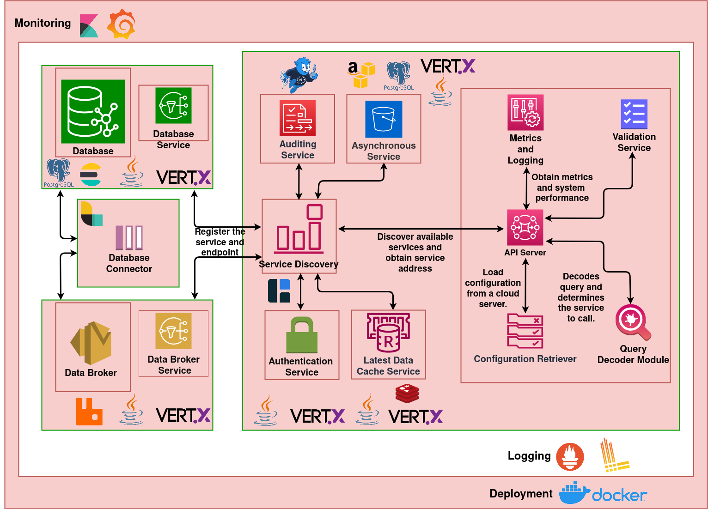

# API Server Interactions

The resource server is the data plane for datasets served by IUDX. Its main function is to serve data to consumers in accordance with the access policy rules set by the provider of the resource. Towards this, the resource server implements an interface with the authorization server to authenticate data access. For any access on protected resources, the resource server requires the consumer to present an access token which it validates using token introspection APIs of the Authorization server before serving the data. The resource server also hosts an interface to a data broker to provide streaming data access to the consumers. Further, to serve data according to search criterias, e.g., temporal search, geo-spatial etc., an interface with a database component is also included in the resource server. The figure below captures various components of the resource server.

# API Server Solution Architecture

## Module 1
## Module 2

